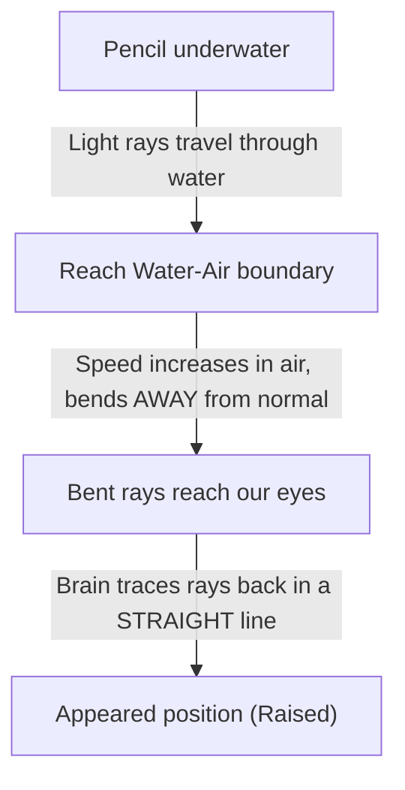

# q1-refraction--clarify (geminiall2)
status: ok | latency: 15.3s

---

Jab light ek medium se dusre medium mein enter karti hai, toh uski speed change ho jati hai, aur isi speed change ki wajah se light apna rasta badal leti hai yaani bend ho jati hai. Yeh concept aapne Class 10 ke 'Light: Reflection and Refraction' chapter mein dekha hoga, aur yeh Class 12 ke 'Ray Optics and Optical Instruments' mein fir se aayega, isliye iska base abhi clear karna bahut helpful rahega.

Ise samajhne ke liye ek simple daily life example lete hain. Imagine kijiye ki aap ek shopping cart (ya trolley) ko road par fast speed mein push kar rahe hain. Agar aap us trolley ko ek angle par mitti (mud) ya grass par le jaate hain, toh jo wheel sabse pehle mitti ko touch karega, wo slow ho jayega. Lekin baki wheels abhi bhi road par fast chal rahe honge. Is asymmetry ki wajah se puri trolley ek taraf turn ho jati hai. 

Light ke sath bhi bilkul yahi hota hai. Air mein light bahut fast travel karti hai, lekin jaise hi wo water mein enter karti hai, uski speed slow ho jati hai. Is speed change ki wajah se light bend ho jati hai, jise hum **refraction** kehte hain.

Ab aate hain aapki pencil par:

Jab light rays pencil ke doobe hue part se nikal kar paani se baahar air mein aati hain, toh wo normal se door (away from the normal) bend ho jaati hain. Hamara brain hamesha assume karta hai ki light ekdum straight line mein travel karti hai. Isliye, hamara brain in bent rays ko piche ki taraf seedha project karta hai. Is projection ki wajah se pencil ka underwater part hume thoda upar utha hua (raised) dikhta hai, aur pencil surface par bent lagti hai.

Ek common mistake jo exams mein hoti hai wo hai light ke bending ki direction ko lekar: jab light denser medium (water) se rarer medium (air) mein jaati hai, toh wo normal se door (away from the normal) bend hoti hai, normal ki taraf nahi. 

Agar hum paani ki jagah koi aur liquid use karein jo paani se bhi zyada optical density rakhta ho (jaise honey ya glycerin), toh pencil pehle se zyada bent dikhegi ya kam? Aapko kya lagta hai?
